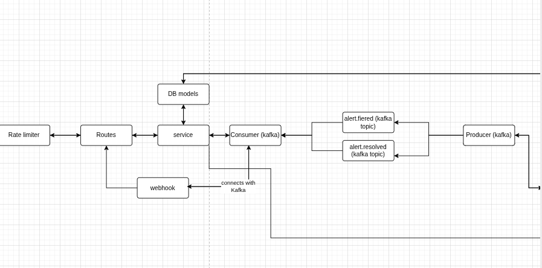
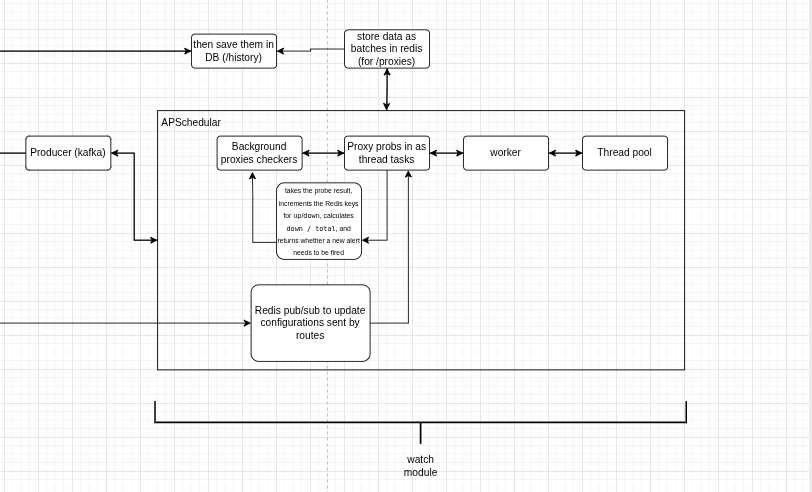

# ProxyMaze — Guide

Comprehensive guide for the ProxyMaze project (ProxyMaze-Hacksters).

This document describes project architecture, models, API endpoints, background monitoring, webhook integrations, deployment options (including PythonAnywhere), testing, troubleshooting, and development notes.


---

## Project overview

ProxyMaze is a lightweight service that monitors a pool of HTTP proxy endpoints and alerts via webhooks when the pool failure rate exceeds a threshold. It was implemented as a Flask application with SQLAlchemy models saved to a local SQLite file and a background monitoring service which probes proxies using `httpx` asynchronously.

Key capabilities:

- Maintain a pool of proxies with CRUD operations
- Background health checks for each proxy (async `httpx` probes)
- Persist check results and proxy metadata to SQLite
- Fire and resolve alerts when failure rate crosses a threshold (0.20)
- Deliver alert notifications to registered webhooks (generic/Slack/Discord) with retry logic
- Track webhook delivery attempts for observability
- Provide metrics and per-proxy history endpoints

This guide documents how everything works and how to run and deploy the system.

---

## setup
- Note: setup kafka, Redis and Postgres via docker to running locally. 
- Activate virtual environment (Linux/macOS)

```source venv/bin/activate```

- Activate it (Windows)

```venv\Scripts\activate```

- Install packages

```pip install -r requirements.txt```

- Run the backend

```flask run```

- test all live endpoints

```python tests/test_live_endpoints.py```

- monitor setup to observe the activity of the schedular

```python scratch/live_monitor.py```

- Setup mock servers to test

```python run_mocks.py```

- test endpoint

```curl -X GET http://127.0.0.1:5000/api/v1/health```

## Deployed link
https://proxymaze-hackster-git-152679548710.asia-southeast1.run.app

## Architecture



## Folder structure
```
proxymaze-flask/
├── app/
│   ├── __init__.py             # Application factory (initializes extensions)
│   ├── api/                    # API Blueprints
│   │   ├── __init__.py
│   │   └── v1_routes.py        # Core endpoints
│   ├── models/                 # Database schemas (e.g., SQLAlchemy)
│   │   └── schemas.py
│   ├── services/               # Business logic & integrations
│   │   ├── torch_service.py    # ISOLATED: Your Torch Proxies integration logic
│   │   └── cache_service.py    # Redis caching layer for efficiency scoring
│   └── utils/                  # Helper functions (logging, formatting)
├── tests/                      
│   ├── conftest.py             # Pytest fixtures
│   └── test_critical.py        # Only test the main Torch Proxies integration path
├── docker-compose.yml          # ONLY for spinning up backing services (DB/Redis) fast
├── requirements.txt            
├── .env                        
├── .gitignore
└── run.py                      # Simple entry point: app = create_app()
```
